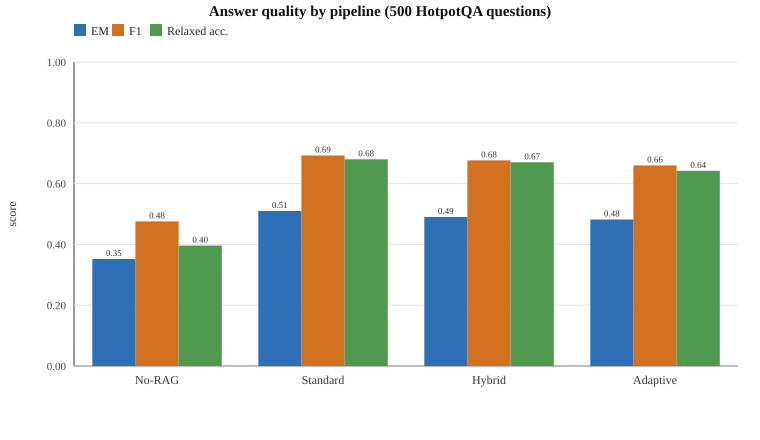
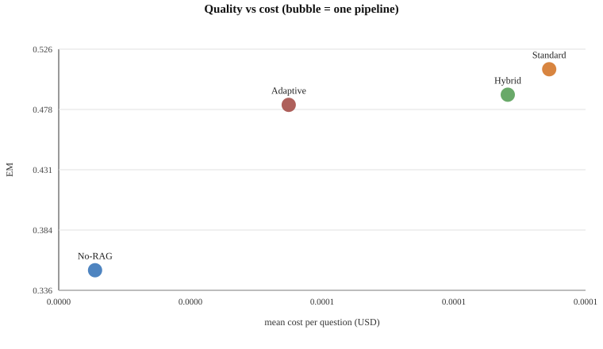
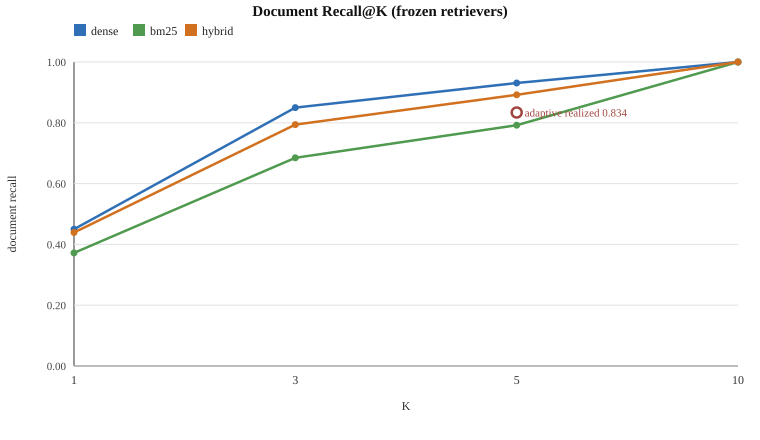
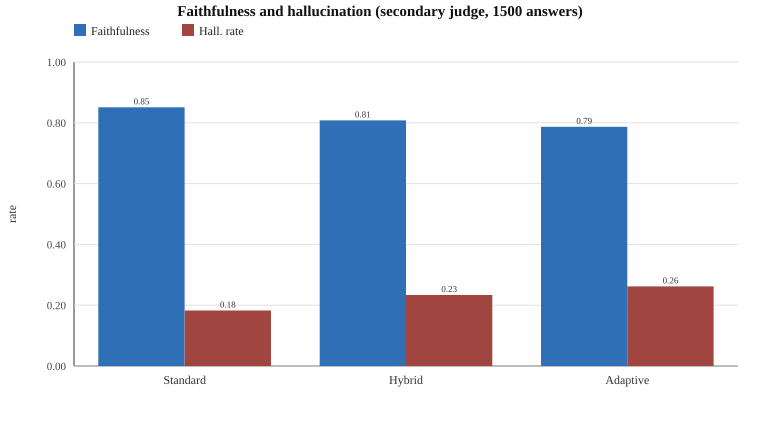
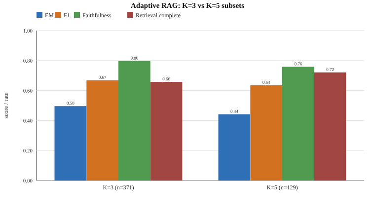
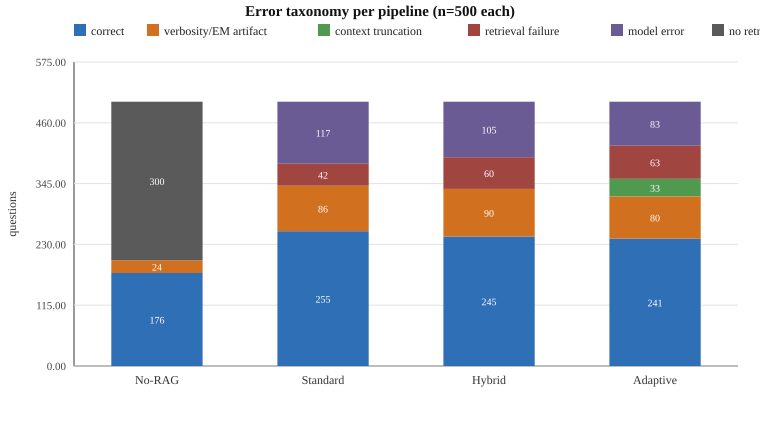

# Final Analysis: Adaptive RAG vs Fixed-K Retrieval (HotpotQA-500)

Paper-readiness pass over the frozen experiment. Every number below is recomputed from the
frozen result files (read-only); nothing was rerun, tuned or modified. Definitions of
faithfulness/hallucination and the adaptive policy were fixed before results were seen.

**Input fingerprints** (paper can pin these):

| Artifact | MD5 |
|---|---|
| `results/no_rag.jsonl` | `57fbc108cb624419168ead0e03df182c` |
| `results/standard_rag.jsonl` | `dc183be6b9db6bc4dfc0b61526fac84f` |
| `results/hybrid_rag.jsonl` | `86ffd927dd7563eda529a280725389fc` |
| `results/adaptive_rag.jsonl` | `7f09a4b10b6e5baf8b63ac2a673327ac` |
| `results/retrieval/dense_retrieval.jsonl` | `d5877da9f63668bec6271dd259d3ee9d` |
| `results/retrieval/bm25_retrieval.jsonl` | `804a7f63b83ce266e6851a945f3e29ce` |
| `results/retrieval/hybrid_retrieval.jsonl` | `5bd7469c1700428f144480d873d377bc` |
| `results/analysis/faithfulness.jsonl` | `c422f640c7d6f8f08e853c33c8ff462a` |

Dataset `data/hotpotqa_500.json` SHA-256 `956405ceb43d73385d60898e1bfc7f45a8184c9a4e1eff45b9a8ec239acfd048` (verified unchanged), 500 questions, deepseek-flash, thinking disabled, temperature 0.0.

**Key findings (paper summary)**

1. **Retrieval is necessary, but only for bridge questions.** Adaptive beats No-RAG 106/41 overall (p≈8e-08) and 100/19 on bridge questions (p≈2e-14), while on comparison questions No-RAG wins 22/6 (p=0.004) under strict EM — largely an EM-verbosity artifact (§7: 18 of 19 such cases have the gold answer inside the RAG prediction).
2. **Adaptive matches Hybrid quality at about half the cost.** EM 0.4820 vs 0.4900 (McNemar p=0.585; F1 95% CI includes 0), input tokens −28.2%, cost $0.02709842 vs $0.05096271 (−46.8%).
3. **Standard dense RAG is the most accurate pipeline** (EM 0.5100/F1 0.6925) and the gap to Adaptive is real but small: 22/36 on EM (p=0.087), F1 Δ −0.0327 [−0.0589, −0.0075], concentrated in bridge questions (15/32, p=0.019).
4. **The adaptive confidence signal is not statistically informative** (Spearman ρ=+0.039, p=0.38; AUC 0.52), so the K=3/K=5 split should not be read as difficulty prediction.
5. **Faithfulness differences are a retrieval effect, not a policy effect.** Overall Adaptive is less faithful than Hybrid (Δ −0.027, CI excludes 0), but when both retrieved all gold documents the difference vanishes (Δ +0.008, CI includes 0); hallucination rate is 0.12–0.13 with complete evidence versus 0.56–0.62 without it.
6. **Error structure:** RAG errors are dominated by verbosity/EM artifacts (~31–35% of wrong answers contain the gold) and grounded model errors (~16–23% of all questions), while context truncation accounts for 33 Adaptive answers (6.6%), all on the K=3 path.

---

## 1. Verification of every reported number

| Quantity | Recomputed | Stored in meta | Check |
|---|---|---|---|
| no_rag · n | 500 | 500 | PASS |
| no_rag · EM | 0.3520 | 0.3520 | PASS |
| no_rag · F1 | 0.4756 | 0.4756 | PASS |
| no_rag · input tokens | 31,120 | 31,120 | PASS |
| no_rag · output tokens | 2,222 | 2,222 | PASS |
| no_rag · cost USD | $0.00600120 | $0.00600120 | PASS |
| no_rag · LLM calls | 490 | 490 | PASS |
| standard_rag · n | 500 | 500 | PASS |
| standard_rag · EM | 0.5100 | 0.5100 | PASS |
| standard_rag · F1 | 0.6925 | 0.6925 | PASS |
| standard_rag · input tokens | 357,810 | 357,810 | PASS |
| standard_rag · output tokens | 3,004 | 3,004 | PASS |
| standard_rag · cost USD | $0.05547390 | $0.05547390 | PASS |
| standard_rag · LLM calls | 490 | 490 | PASS |
| hybrid_rag · n | 500 | 500 | PASS |
| hybrid_rag · EM | 0.4900 | 0.4900 | PASS |
| hybrid_rag · F1 | 0.6764 | 0.6764 | PASS |
| hybrid_rag · input tokens | 367,325 | 367,325 | PASS |
| hybrid_rag · output tokens | 2,985 | 2,985 | PASS |
| hybrid_rag · cost USD | $0.05096271 | $0.05096271 | PASS |
| hybrid_rag · LLM calls | 474 | 474 | PASS |
| adaptive_rag · n | 500 | 500 | PASS |
| adaptive_rag · EM | 0.4820 | 0.4820 | PASS |
| adaptive_rag · F1 | 0.6598 | 0.6598 | PASS |
| adaptive_rag · input tokens | 263,640 | 263,640 | PASS |
| adaptive_rag · output tokens | 3,119 | 3,119 | PASS |
| adaptive_rag · cost USD | $0.02709842 | $0.02709842 | PASS |
| adaptive_rag · LLM calls | 360 | 360 | PASS |
| faithfulness entries | 1,500 | 1,500 | PASS |
| faithfulness judge errors | 1 | 1 | PASS |
| dense_retrieval Recall@5 | 0.9310 | — | PASS |
| bm25_retrieval Recall@5 | 0.7920 | — | PASS |
| hybrid_retrieval Recall@5 | 0.8920 | 0.8920 | PASS |

All recomputed values match the stored metadata; the one judge parse failure is retained as
`judge_error` in the faithfulness artifact.

## 2. Overall pipeline comparison

| Pipeline | EM | F1 | Relaxed acc. (gold contained) | Input tok | Cost (USD) | LLM calls | Doc recall @used K |
|---|---|---|---|---|---|---|---|
| No-RAG | 0.3520 | 0.4756 | 0.3960 | 31,120 | $0.00600120 | 490 | N/A |
| Standard RAG | 0.5100 | 0.6925 | 0.6800 | 357,810 | $0.05547390 | 490 | 0.9310 |
| Hybrid RAG | 0.4900 | 0.6764 | 0.6700 | 367,325 | $0.05096271 | 474 | 0.8920 |
| Adaptive RAG | 0.4820 | 0.6598 | 0.6420 | 263,640 | $0.02709842 | 360 | 0.8340 |

Relaxed accuracy counts an answer as correct when all gold tokens appear in the prediction;
it is a *loose upper bound* that mainly exposes verbose answers (see §6).

## 3. Quality vs token/cost trade-off

| Pipeline | Cost / question | 95% CI (bootstrap) | Input tok / question | Cost / correct | Input tok / correct |
|---|---|---|---|---|---|
| No-RAG | $0.00001200 | [0.00001164, 0.00001247] | 62.2 | $0.00003410 | 176.8 |
| Standard RAG | $0.00011095 | [0.00010850, 0.00011333] | 715.6 | $0.00021754 | 1403.2 |
| Hybrid RAG | $0.00010193 | [0.00009936, 0.00010447] | 734.6 | $0.00020801 | 1499.3 |
| Adaptive RAG | $0.00005420 | [0.00005104, 0.00005739] | 527.3 | $0.00011244 | 1093.9 |

Adaptive vs Hybrid: cost **-46.8%**, input tokens **-28.2%**, EM retention **98.4%**.

## 4. Retrieval performance (frozen artifacts)

| Retriever | Recall@1 | Recall@3 | Recall@5 | Recall@10 |
|---|---|---|---|---|
| dense | 0.4500 [0.4360, 0.4630] | 0.8500 [0.8280, 0.8710] | 0.9310 [0.9150, 0.9460] | 1.0000 [1.0000, 1.0000] |
| bm25 | 0.3720 [0.3530, 0.3910] | 0.6850 [0.6590, 0.7120] | 0.7920 [0.7690, 0.8160] | 1.0000 [1.0000, 1.0000] |
| hybrid | 0.4390 [0.4240, 0.4520] | 0.7940 [0.7710, 0.8160] | 0.8920 [0.8740, 0.9100] | 1.0000 [1.0000, 1.0000] |

| Retriever | Complete@1 | Complete@3 | Complete@5 | Complete@10 |
|---|---|---|---|---|
| dense | 0.0000 | 0.7220 | 0.8640 | 1.0000 |
| bm25 | 0.0000 | 0.4360 | 0.6120 | 1.0000 |
| hybrid | 0.0000 | 0.6080 | 0.7880 | 1.0000 |

Pipeline-level realized retrieval (at the K each pipeline actually used):

| Pipeline | K | Mean docs | Doc recall | Sentence recall | Doc complete |
|---|---|---|---|---|---|
| No-RAG | none | 0.00 | N/A | N/A | N/A |
| Standard RAG | 5 | 4.98 | 0.9310 | 0.6718 | 0.8640 |
| Hybrid RAG | 5 | 4.98 | 0.8920 | 0.6627 | 0.7880 |
| Adaptive RAG | mixed (3/5) | 3.51 | 0.8340 | 0.5914 | 0.6740 |

## 5. Faithfulness and hallucination (secondary judge)

| Pipeline | Faithfulness | Hall. score | Hall. rate | Fully grounded | Abstentions |
|---|---|---|---|---|---|
| Standard RAG | 0.8511 | 0.1489 | 0.1826 | 0.8174 | 7 |
| Hybrid RAG | 0.8078 | 0.1922 | 0.2334 | 0.7666 | 2 |
| Adaptive RAG | 0.7870 | 0.2130 | 0.2618 | 0.7382 | 11 |

| Pipeline | Retrieval | n | Faithfulness | Hall. rate |
|---|---|---|---|---|
| Standard RAG | gold docs complete | 431 | 0.8975 | 0.1276 |
| Standard RAG | gold docs incomplete | 62 | 0.5282 | 0.5645 |
| Hybrid RAG | gold docs complete | 392 | 0.8999 | 0.1301 |
| Hybrid RAG | gold docs incomplete | 105 | 0.4643 | 0.6190 |
| Adaptive RAG | gold docs complete | 336 | 0.9107 | 0.1161 |
| Adaptive RAG | gold docs incomplete | 153 | 0.5153 | 0.5817 |

Paired faithfulness differences (bootstrap 95% CI), and the same difference restricted to
questions where both pipelines had *all gold documents* (the retrieval-matched comparison):

| Comparison | Stratum | n | Mean Δ faithfulness | 95% CI | CI excludes 0 |
|---|---|---|---|---|---|
| Adaptive RAG − Hybrid RAG | all | 488 | -0.0270 | [-0.0478, -0.0065] | yes |
| Adaptive RAG − Hybrid RAG | doc-complete both | 335 | +0.0080 | [-0.0050, +0.0224] | no |
| Adaptive RAG − Standard RAG | all | 486 | -0.0674 | [-0.1000, -0.0350] | yes |
| Adaptive RAG − Standard RAG | doc-complete both | 320 | +0.0112 | [-0.0094, +0.0339] | no |
| Hybrid RAG − Standard RAG | all | 492 | -0.0388 | [-0.0686, -0.0097] | yes |
| Hybrid RAG − Standard RAG | doc-complete both | 369 | +0.0052 | [-0.0120, +0.0233] | no |

## 6. Adaptive K=3 vs K=5

| Path | n | EM | F1 | Faithfulness | Hall. rate | Input tok/q | Cost | Retrieval complete | Hybrid@5 complete |
|---|---|---|---|---|---|---|---|---|---|
| K=3 | 371 | 0.4960 | 0.6684 | 0.7971 | 0.2465 | 455.1 | $0.012938 | 0.6577 | 0.8113 |
| K=5 | 129 | 0.4419 | 0.6351 | 0.7585 | 0.3047 | 734.8 | $0.014160 | 0.7209 | 0.7209 |

K=3 vs K=5 (between-subset tests, **not** causal): EM χ² p=0.339; faithfulness Mann–Whitney p=0.234. The apparent K=3 advantage is therefore **descriptive, not statistically supported**.

Within-subset truncation cost (same questions, same ranking prefix): on the 371 K=3 questions, Hybrid@5 retrieved all gold documents 81.1% of the time versus 65.8% for Adaptive@3.

## 7. Error analysis

Taxonomy precedence (deterministic, computed from frozen fields):

1. **correct** — `exact_match = 1`.
2. **verbosity/EM artifact** — wrong under EM, but all gold tokens appear in the prediction.
3. **context truncation** — Adaptive K=3 only: the gold document was in the hybrid pool but was
   cut off at K=3 (`complete@3 = 0`, `complete@5 = 1`).
4. **retrieval failure** — gold documents missing from the context actually supplied.
5. **model error** — evidence present, no gold in the answer and no truncation loss.
   (No-RAG uses **no retrieval (parametric only)** instead of 3–5, since it has no context.)

| Error class | No-RAG | Standard RAG | Hybrid RAG | Adaptive RAG |
|---|---|---|---|---|
| correct | 176 (35.2%) | 255 (51.0%) | 245 (49.0%) | 241 (48.2%) |
| verbosity/EM artifact | 24 (4.8%) | 86 (17.2%) | 90 (18.0%) | 80 (16.0%) |
| context truncation | 0 (0.0%) | 0 (0.0%) | 0 (0.0%) | 33 (6.6%) |
| retrieval failure | 0 (0.0%) | 42 (8.4%) | 60 (12.0%) | 63 (12.6%) |
| model error | 0 (0.0%) | 117 (23.4%) | 105 (21.0%) | 83 (16.6%) |
| no retrieval (parametric only) | 300 (60.0%) | 0 (0.0%) | 0 (0.0%) | 0 (0.0%) |

Artifact bound: among *wrong* answers, the gold was contained in the prediction for
| Pipeline | Wrong answers | Contained (upper bound) | Prefix match (lower bound) |
|---|---|---|---|
| No-RAG | 324 | 24 (7.4%) | 10 (3.1%) |
| Standard RAG | 245 | 86 (35.1%) | 48 (19.6%) |
| Hybrid RAG | 255 | 90 (35.3%) | 47 (18.4%) |
| Adaptive RAG | 259 | 80 (30.9%) | 46 (17.8%) |

The bracket is the honest range for “correct but scored wrong by EM”: containment is loose
(any 1-token gold such as *no* is trivially contained), the prefix test is conservative.

Conditioned on the evidence actually being present (all gold docs retrieved):

| Pipeline | Questions with all gold docs | Wrong | Model error | EM artifact |
|---|---|---|---|---|
| Standard RAG | 432 | 195 | 117 | 78 |
| Hybrid RAG | 394 | 184 | 105 | 79 |
| Adaptive RAG | 337 | 149 | 83 | 66 |

Model errors with the evidence present are largely *grounded* mistakes rather than fabrications:
| Pipeline | Model errors (evidence present) | Hallucination rate | Faithfulness |
|---|---|---|---|
| Standard RAG | 116 | 0.1810 | 0.8513 |
| Hybrid RAG | 104 | 0.1635 | 0.8822 |
| Adaptive RAG | 82 | 0.1707 | 0.8780 |

### Representative cases

| Pipeline | Class | qid | Type | K | Gold | Prediction | Doc recall |
|---|---|---|---|---|---|---|---|
| No-RAG | verbosity/EM artifact | 5a7108fa5542994082a3e4ef | comparison | K=— | Second Battle of Bull Run | The Second Battle of Bull Run was fought first. | N/A |
| No-RAG | no retrieval (parametric only) | 5a71278c5542994082a3e5e2 | bridge | K=— | J. Cole | Timbaland | N/A |
| Standard RAG | verbosity/EM artifact | 5a7108fa5542994082a3e4ef | comparison | K=5 | Second Battle of Bull Run | The Second Battle of Bull Run was fought first. | 1.0000 |
| Standard RAG | retrieval failure | 5a719bf25542994082a3e891 | bridge | K=5 | BFH | B²FH paper | 0.5000 |
| Standard RAG | model error | 5a72a9ab5542992359bc315a | bridge | K=5 | the Pennacook people | The Pennacook. | 1.0000 |
| Hybrid RAG | verbosity/EM artifact | 5a7108fa5542994082a3e4ef | comparison | K=5 | Second Battle of Bull Run | The Second Battle of Bull Run was fought first. | 1.0000 |
| Hybrid RAG | retrieval failure | 5a7129685542994082a3e5fa | bridge | K=5 | Vitor Belfort | Rashad Evans | 0.5000 |
| Hybrid RAG | model error | 5a716dc15542994082a3e82b | bridge | K=5 | Kirk Humphreys | Tom Coburn | 1.0000 |
| Adaptive RAG | verbosity/EM artifact | 5a7108fa5542994082a3e4ef | comparison | K=3 | Second Battle of Bull Run | The Second Battle of Bull Run was fought first. | 1.0000 |
| Adaptive RAG | context truncation | 5a71278c5542994082a3e5e2 | bridge | K=3 | J. Cole | Colonel Alexander Boyd Andrews | 0.5000 |
| Adaptive RAG | retrieval failure | 5a7129685542994082a3e5fa | bridge | K=5 | Vitor Belfort | Rashad Evans | 0.5000 |
| Adaptive RAG | model error | 5a716dc15542994082a3e82b | bridge | K=3 | Kirk Humphreys | Tom Coburn | 1.0000 |

## 8. Statistical summary: supported vs descriptive

**Statistically supported** (CI excludes 0 or p < 0.05):

| Test | Statistic | p | Verdict |
|---|---|---|---|
| Adaptive vs No-RAG | 106/41 | 8.09e-08 | supported |
| Adaptive vs Standard RAG | 22/36 | 0.08695 | not supported |
| Adaptive vs Hybrid RAG | 13/17 | 0.5847 | not supported |
| F1 Δ Adaptive RAG − Hybrid RAG | -0.0166 [-0.0367, +0.0029] | — | not supported |
| F1 Δ Adaptive RAG − Standard RAG | -0.0327 [-0.0589, -0.0075] | — | supported |
| F1 Δ Hybrid RAG − Standard RAG | -0.0161 [-0.0398, +0.0077] | — | not supported |
| Faithfulness Δ Adaptive RAG − Hybrid RAG (all) | -0.0270 [-0.0478, -0.0065] | — | supported |
| Faithfulness Δ (retrieval-matched, n=335) | +0.0080 [-0.0050, +0.0224] | — | not supported |
| Faithfulness Δ Adaptive RAG − Standard RAG (all) | -0.0674 [-0.1000, -0.0350] | — | supported |
| Faithfulness Δ (retrieval-matched, n=320) | +0.0112 [-0.0094, +0.0339] | — | not supported |
| Adaptive confidence vs EM (Spearman) | rho=+0.0394 | 0.379 | not supported |

**Descriptive only (not statistically supported at n=500):**

- K=3 vs K=5 EM and faithfulness differences (χ² p=0.339, Mann–Whitney p=0.234); the higher K=3 subset score is a selection effect visible in the availability of gold documents.
- Adaptive vs Hybrid EM difference (p=0.585) and F1 difference (CI includes 0).
- Adaptive vs Standard EM difference (p=0.087); the F1 gap is small but its CI excludes zero.
- Confidence-vs-correctness association (ρ=+0.039, p=0.379).
- All per-slice comparisons other than the two significant No-RAG contrasts (bridge p≈2e-14, comparison p=0.004) are underpowered; they are reported as effect sizes, not verdicts.

| Slice | Comparison | wins/losses | McNemar p |
|---|---|---|---|
| ALL | Adaptive vs No-RAG | 106/41 | 8.089e-08 |
| ALL | Adaptive vs Standard RAG | 22/36 | 0.08695 |
| ALL | Adaptive vs Hybrid RAG | 13/17 | 0.5847 |
| bridge | Adaptive vs No-RAG | 100/19 | 1.814e-14 |
| bridge | Adaptive vs Standard RAG | 15/32 | 0.01862 |
| bridge | Adaptive vs Hybrid RAG | 11/13 | 0.8388 |
| comparison | Adaptive vs No-RAG | 6/22 | 0.003719 |
| comparison | Adaptive vs Standard RAG | 7/4 | 0.5488 |
| comparison | Adaptive vs Hybrid RAG | 2/4 | 0.6875 |

## 9. Caveats and limitations

- Single run per pipeline (temperature 0.0; hosted-model nondeterminism not measured).
- EM/F1 are sensitive to answer verbosity; the containment bracket in §7 quantifies this
  (roughly a fifth to a third of RAG errors contain the gold answer).
- Faithfulness is judged by an LLM (1/1500 parse failure) and is *not* correctness; it is
  undefined without context, so No-RAG is excluded from §5.
- Adaptive cost/latency include 140 cache replays of identical prompts (cost accounting uses
  the project's shared convention, which prices replayed tokens).
- Retrieval compute is reused from frozen artifacts, so savings are context-length savings.
- `retrieval_artifact_sha256` in the adaptive meta equals the dataset hash (a labeling quirk of
  the frozen metadata); the retrieval artifact itself is fingerprinted above.

## 10. Figures

| Figure | Content |
|---|---|
| `docs/figures/f1_overall.svg` | Answer quality (EM, F1, relaxed accuracy) by pipeline |
| `docs/figures/f2_cost_quality.svg` | Quality vs cost per question |
| `docs/figures/f3_retrieval.svg` | Document Recall@K for dense/BM25/hybrid + adaptive realized |
| `docs/figures/f4_faithfulness.svg` | Faithfulness and hallucination rate by pipeline |
| `docs/figures/f5_adaptive_k.svg` | Adaptive K=3 vs K=5 subsets |
| `docs/figures/f6_error_taxonomy.svg` | Error taxonomy per pipeline |

